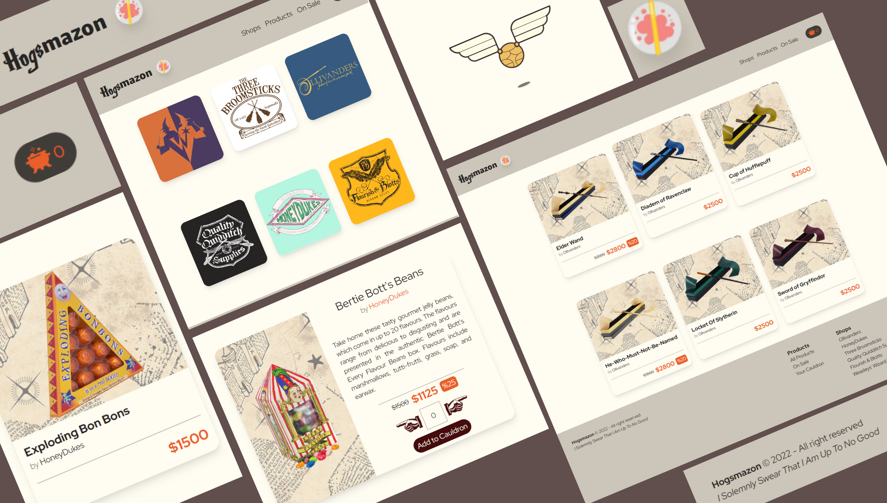

# Hogsmazon

## Sobre el Proyecto

Pequeño proyecto E-commerce simulando una tienda en el universo de Harry Potter, con productos divididos por tiendas famosas de la saga, utilizacion Firebase de base de datos para poder acceder a ellos, realizado como proyecto para el Curso de React de CoderHouse

## Herramientas utilizadas

### Visitalo!

https://hogsmazon.vercel.app/

